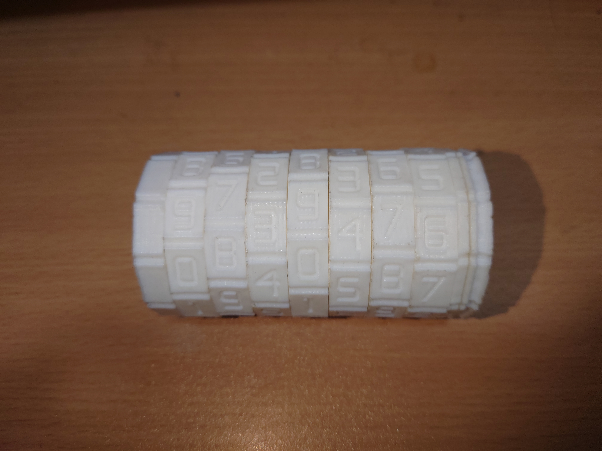
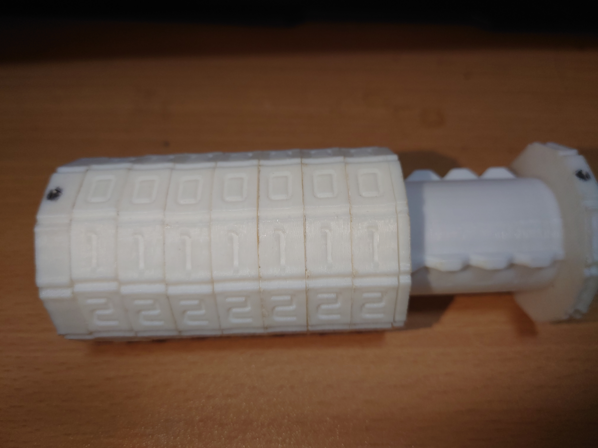

# cura 3d printing profile for ender 3 pro

This is the setting for ender 3 pro 3d printer to print well, after some try. This profile is also good for 0.1mm and 0.3mm layer height, but the best is 0.2mm. I choose these setting in this profile because I think it is at the balance of product strenght, printing speed, and material usage. I suggest to use paper masking tape and paste that on the factory printing bed, that can provide a good griping on the product when in printing, without need to much effort to pull it out of the printer bed (if print on the original printer bed, the product will stick at there hardly, which is very hard to pull it out).  

Se below picture for a Cryptex Combination Safe (7-ring, all number) I printed using the profile:
 

 

I get the stl from : <https://www.thingiverse.com/thing:586169>
All moving parts move smoothly, just a little resistence, I haven't sand the parts at all. Such result is quite good for a fdm 3d printer.

Normally, base on this profile, when I want a best quality, I will print in 0.1mm layer height and 40mm/s speed (product surface become very fine but print speed is very 
slow). But if want the best printing speed, 120mm/s and 0.3mm layer height (the surface will be "rough"). If want some product with high strenght, I suggest use 6-8 
layer of wall(profile is 2), that already provide quite a lot of strenght. I find the 120mm/s is the max this printer can do, more than that, the chances of having 
printing failure become quite significant. For the infill types, cubic is used as it can provide even strenght in both x, y direction of the product.  

Please also remined that to print with great air ventilation for safety.
